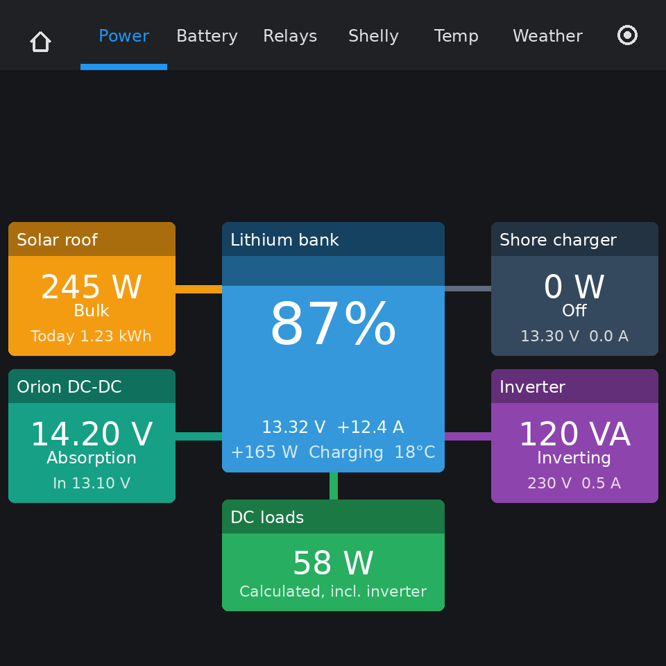

# esp32-S3-ws4-caravan

Caravan display for the **Waveshare ESP32-S3-Touch-LCD-4 (V4)**, the 480×480 touch board with the CH32V003 IO expander. Built with Arduino and LVGL 8.



*The Power tab with example values. Dots move along the lines where energy flows.*

## Features

| Tab | What it shows |
|---|---|
| **⌂ Home** | Start page: large clock and date, surrounded by cards for solar, battery, inside temperature, outside weather and relays |
| **Power** | Tap any tile (or the History button) for bar charts of the last 24 hours and 30 days. Victron devices over Bluetooth (Instant Readout): solar chargers, battery monitor, DC-DC, AC charger and inverter, in a classic Victron overview style with animated energy flows |
| **Battery** | *Experimental:* the battery's own BMS over Bluetooth (JBD protocol, used by many ECO-WORTHY batteries): SOC, voltage, current, capacity, cycles, temperatures, cell voltages |
| **Shelly** | Up to 4 Shelly plugs/switches over Bluetooth (BLE RPC): on/off and power. Off by default; pair them under Settings |
| **Relays** | Up to 8 relays on an external PCF8574 I2C board, with your own names. Each relay is an Off | On segmented control in the Victron switch-pane style, so a stray touch can't toggle anything |
| **Temp** | Up to 3 named RuuviTags: temperature, humidity, pressure, battery |
| **Weather** | NTP clock, current weather and a 3-day forecast from Open-Meteo (no API key) |
| **⚙ Settings** | WiFi, weather location, RuuviTags, display brightness, sensor scan interval, Victron devices, relay board, I2C scan |

A small **web page** mirrors the Home tab: clock with battery and solar gauges, temperatures, a weather forecast, the Victron devices (and which are charging), the relays and the Shelly devices. Open **`http://waveshare.local/`** (or the board's IP, shown under Settings → WiFi) from a phone or computer on the same WiFi. The same data is available as JSON at `/json`, and the recent log at `/log`. The page is read-only.

The Settings page is grouped into sections (WiFi, Web page, Weather, Temperature, Battery, Victron, Relays, Display, Scan interval, I2C). **Temperature, Battery, Relays and Shelly each have an on/off switch**: switching one off also stops its background work (Bluetooth decoding, BMS connection, I2C traffic). The Temperature, Battery, Relays and Shelly tabs disappear from the tab bar while they are off. The battery itself is chosen under Settings → Battery.

Under **Settings → Web page** you can name the page (default "Waveshare"), switch on **Remote admin** so relays and Shelly devices can be switched from the browser (off by default, and it still requires the password), and set a password; the page then asks for it once (the login lasts 30 days, or until the board restarts or the password changes). Scripts can use `/json?key=<password>`. Leave the password empty for no login. The page uses plain HTTP, so the password keeps casual visitors on the same WiFi out, but is not strong security. The name `waveshare` is set by `MDNS_NAME` in `app.h`.

After 30 seconds without touch, a screen saver shows a dim clock and the battery state of charge (bar, percentage and a charging symbol), and lowers the backlight. A tap wakes it.

All settings are saved in flash and survive restarts.

## Screen saver

To adjust the look, change these lines at the top of `ui_saver.cpp`:

```cpp
#define SAVER_BAR_BG 0x202020     // empty part of the SOC bar
#define SAVER_LOW_COLOR 0x702020  // bar color at low SOC (dim red)
#define SAVER_LOW_SOC 20          // below this % the bar turns red
```

A small **web page** mirrors the Home tab: clock with battery and solar gauges, temperatures, a weather forecast, the Victron devices (and which are charging), the relays and the Shelly devices. Open **`http://waveshare.local/`** (or the board's IP, shown under Settings → WiFi) from a phone or computer on the same WiFi. The same data is available as JSON at `/json`, and the recent log at `/log`. The page is read-only.

The Settings page is grouped into sections (WiFi, Web page, Weather, Temperature, Battery, Victron, Relays, Display, Scan interval, I2C). **Temperature, Battery, Relays and Shelly each have an on/off switch**: switching one off also stops its background work (Bluetooth decoding, BMS connection, I2C traffic). The Temperature, Battery, Relays and Shelly tabs disappear from the tab bar while they are off. The battery itself is chosen under Settings → Battery.

Under **Settings → Web page** you can name the page (default "Waveshare"), switch on **Remote admin** so relays and Shelly devices can be switched from the browser (off by default, and it still requires the password), and set a password; the page then asks for it once (the login lasts 30 days, or until the board restarts or the password changes). Scripts can use `/json?key=<password>`. Leave the password empty for no login. The page uses plain HTTP, so the password keeps casual visitors on the same WiFi out, but is not strong security. The name `waveshare` is set by `MDNS_NAME` in `app.h`.

After 30 seconds without touch, a screen saver shows a dim clock and lowers the backlight. A tap wakes it.

## Getting started

1. Install the libraries and set the Arduino IDE options listed below.
2. Open `esp32-S3-ws4-caravan.ino` and upload.
3. On the board, open **⚙ Settings**:
   - **WiFi:** tap Scan, pick your network, enter the password, tap Connect.
   - **Weather location:** type a city (or `City, Country`) and tap Set.
   - **RuuviTags:** pick a tag from the list, tap Add and give it a name. Up to 3 tags; tap one in the list to rename or delete it.
   - **Victron devices:** pick a device, tap Add, then enter a name and its 32-character encryption key.
   - **Relay board:** tap *Scan I2C bus* to find the PCF8574, then choose its address.

The Serial Monitor (115200 baud) logs startup, free memory, WiFi and weather lookups.

## Files

Everything is in one flat folder. `app.h` holds the shared configuration, data types and declarations; each `.cpp` file is one module.

| File | Contents |
|---|---|
| `esp32-S3-ws4-caravan.ino` | `setup()` and `loop()` |
| `app.h` | Configuration, data types, shared state, module functions |
| `state.cpp` | Shared state, loading settings, small helpers |
| `sdlog.cpp` | Logging to Serial, to a memory buffer (web `/log`) and to the TF card |
| `datalog.cpp` | Measurements as CSV, settings backup and restore |
| `board.cpp` | Display, touch, IO expander, LVGL driver, backlight |
| `net.cpp` | Network task: WiFi, NTP, weather, all flash writes |
| `web.cpp` | Web page and JSON with battery, Victron and relay status |
| `ble.cpp` | Bluetooth scanning |
| `bms.cpp` | Battery BMS connection: ECO-WORTHY and JBD protocols, plus diagnostics |
| `shelly.cpp` | Shelly devices over BLE RPC (pairing, status, switching) |
| `ruuvi.cpp` | RuuviTag decoding |
| `victron.cpp` | Victron decryption and decoding |
| `relays.cpp` | PCF8574 relays and I2C scan |
| `ui_common.cpp` | Tabs, keyboard, widget helpers, timers |
| `ui_home.cpp` | Home tab (start page) |
| `ui_power.cpp` | Power tab |
| `history.cpp` | Energy history: hourly and daily totals |
| `ui_history.cpp` | History screen (bar chart, opened from the Power tab) |
| `ui_battery.cpp` | Battery tab (experimental) |
| `ui_relays.cpp` | Relays tab + relay and I2C settings |
| `ui_shelly.cpp` | Shelly tab + Shelly pairing settings |
| `ui_temp.cpp` | Temp tab (RuuviTag cards) |
| `ui_weather.cpp` | Weather tab and clock |
| `ui_settings.cpp` | Settings tab (WiFi, location, RuuviTags, display, scan interval) |
| `ui_victron_settings.cpp` | Victron device settings |
| `ui_saver.cpp` | Screen saver |
| `font_clock_96.c` | 96 px clock font for the screen saver (digits, `:` and `-`) |
| `power-tab.png` | Power tab picture for this README |
| `memory.md` | Notes and plan for lowering memory use and latency |

## Libraries

- **lvgl 8.x** (with the `lv_conf.h` from Waveshare's examples)
- **GFX Library for Arduino**, **SensorLib** and **WS_CH32_IO**: the versions bundled with Waveshare's ESP32-S3-Touch-LCD-4 examples
- **ArduinoJson** v7
- **NimBLE-Arduino** by h2zero, v2.x

## Arduino IDE settings

- Board: ESP32S3 Dev Module
- **PSRAM: OPI PSRAM** (the display framebuffer and LVGL buffers live there)
- **Erase All Flash Before Sketch Upload: Disabled**, otherwise every upload wipes the saved settings

Optional, in `lv_conf.h`:

- Enable `LV_FONT_MONTSERRAT_32` and `LV_FONT_MONTSERRAT_48` for a large clock and temperatures
- To free internal RAM, move LVGL's memory pool to PSRAM:
  ```c
  #define LV_MEM_POOL_INCLUDE <esp32-hal-psram.h>
  #define LV_MEM_POOL_ALLOC ps_malloc
  ```

## Logging

Diagnostics (Bluetooth frames, connections, errors) go to the Serial Monitor and to a
24 kB buffer in PSRAM that you can read in a browser at `/log` without attaching a computer.
Switch on **Settings → SD card** to also append everything to `/caravan.log` on the TF card
(SDMMC 1-bit mode: GPIO2 clock, GPIO1 command, GPIO4 data). The file is flushed every 5 seconds. The same section has Mount, Eject, New log and Delete old logs, plus card type and free space. Log files can be listed and downloaded in the browser at `/files`.

**Measurements as CSV:** switch on "Log measurements" to append a line to `/data.csv` every 1, 5, 15 or 60 minutes: time, SOC, battery voltage/current/power, solar power and yield, the three RuuviTag temperatures, outside temperature, relays on and Shelly power. Download it from `/files` and open it in a spreadsheet.

**Settings backup:** "Back up settings" writes everything to `/settings.json` on the card, including WiFi and Victron encryption keys, so keep the card safe. "Restore" reads it back and restarts the board, which is the quick way back after an accidental flash erase.

## Hardware notes

- **Backlight** PWM comes from the CH32V003 and is inverted on this board (0 = full brightness, 255 = off). This is handled in `set_backlight()`.
- **External I2C** shares GPIO15/7 with touch and the CH32V003. The PCF8574 only supports 100 kHz, so the bus slows down briefly while talking to it.
- ⚠️ Many PCF8574 relay boards pull I2C up to 5 V. The ESP32 is **not** 5 V tolerant: power the PCF8574 from 3.3 V, or make sure its pull-ups go to 3.3 V.
- **Victron**: enable *Instant readout via Bluetooth* in VictronConnect and copy the encryption key from *Product info*.
- **Battery tab (experimental)**: pick the battery in the list and tap Connect. Close the ECO-WORTHY app first, as the battery accepts only one Bluetooth connection. Batteries with a JBD BMS are decoded; for other BMS types the tab and the Serial Monitor show the GATT services and raw data, which is what's needed to add support.
- **Weather** uses plain HTTP: HTTPS needs more internal RAM than is free with WiFi, Bluetooth and the display running.

## Troubleshooting

| Problem | Likely cause |
|---|---|
| Settings are gone after an upload | *Erase All Flash Before Sketch Upload* is enabled |
| City lookup or weather fails | Check the `HTTP` and `Internal heap` lines in the Serial Monitor. Low free RAM breaks network requests |
| Victron device shows "Wrong key" | Key mistyped, or it changed in VictronConnect |
| Victron device shows "No signal" | Out of range, or Instant readout switched off |
| Relays show "No answer from PCF8574" | Wrong address (run the I2C scan), wiring, or power |
| Relays switch the wrong way | Toggle *Active low* in Settings |
| Image shifted down (tab bar too low) | The RGB panel lost sync, usually at startup. Press reset. The pixel clock is set to 12 MHz in `board.cpp` to reduce it; bounce buffers would fix it properly but need a newer GFX Library for Arduino |
