<!-- esp32-S3-ws4-caravan v1.0 -->
# esp32-S3-ws4-caravan

**Version 1.0** - the first release. What changed in each version is in [CHANGELOG.md](CHANGELOG.md).

See **[BOARD_NOTES.md](BOARD_NOTES.md)** for hard-won notes about this board: SD card wiring, memory limits, LVGL 8 pitfalls and the BLE protocols used here.


Caravan display for the **Waveshare ESP32-S3-Touch-LCD-4 (V4)**, the 480×480 touch board with the CH32V003 IO expander. Built with Arduino and LVGL 8.

## Screens

| | |
|---|---|
| 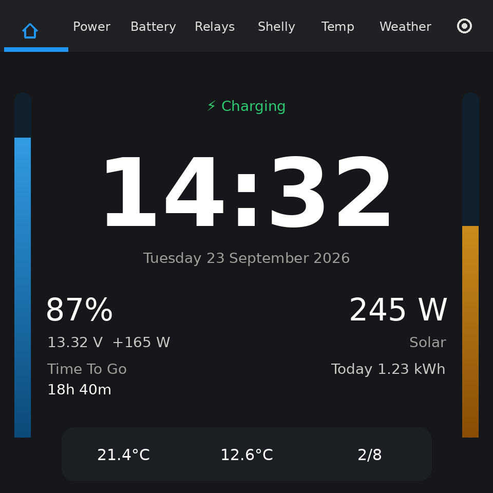 | 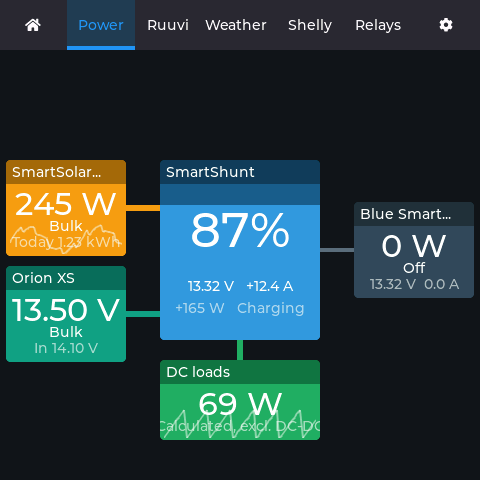 |
| **Home** – clock between battery and solar gauges, ten-minute graphs under each, temperatures and relays below, WiFi signal top right | **Power** – the battery in the middle, chargers left, AC side right, DC loads below; each connection lights up in its own colour while energy flows |
| 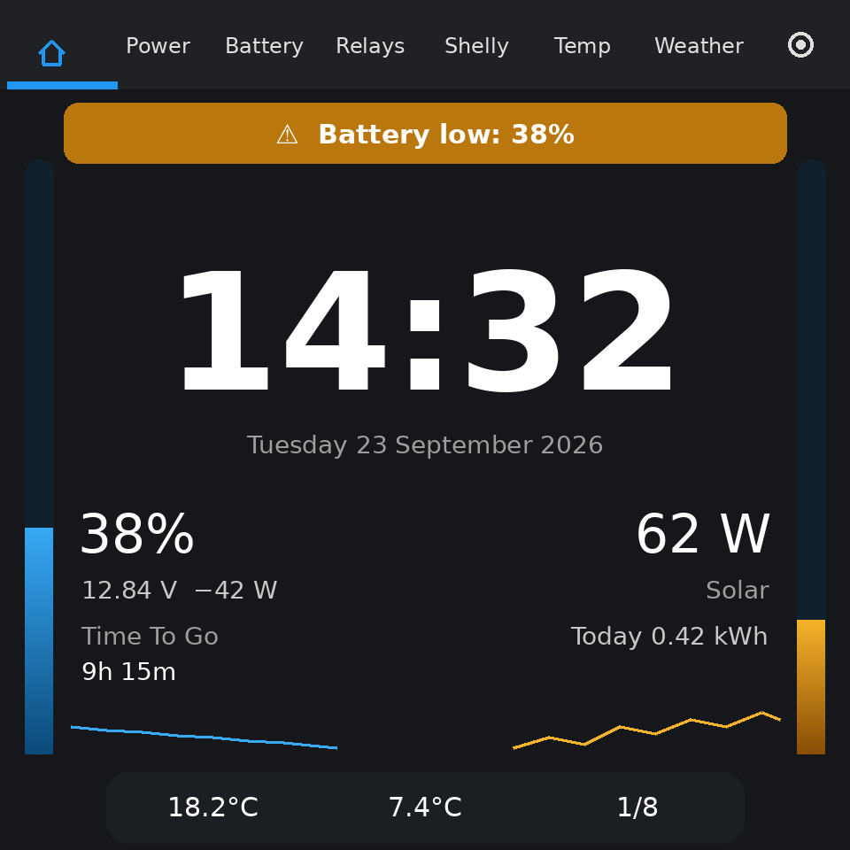 | 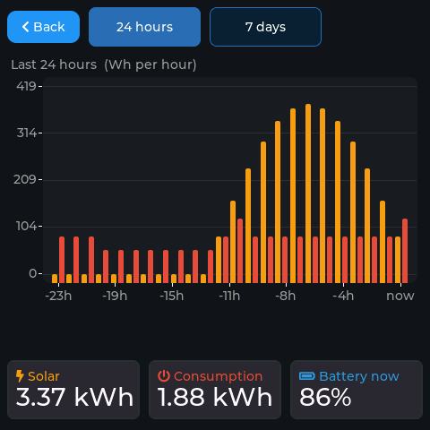 |
| **Warnings and alarms** – a banner on Home, orange for warnings and red for alarms | **History** – solar and consumption per hour or per day, reached by tapping a Power tile |
| 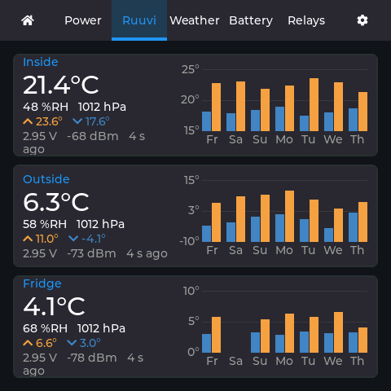 | 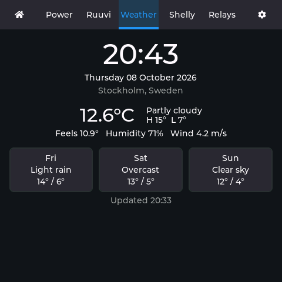 |
| **Ruuvi** – each tag with its reading and the last 7 days: daily low in blue, high in orange | **Weather** – now, today's high and low, and three days ahead |
| 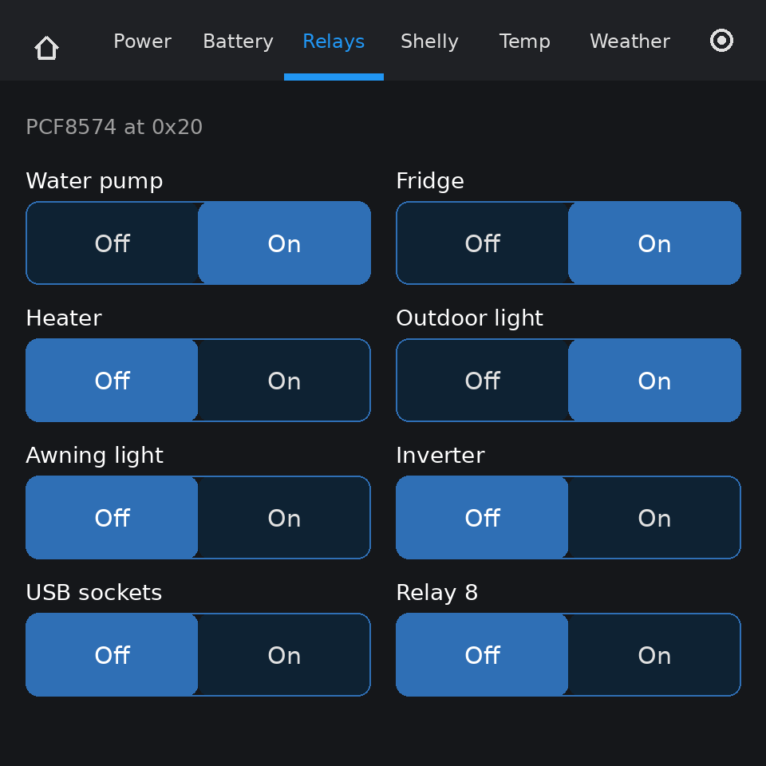 | 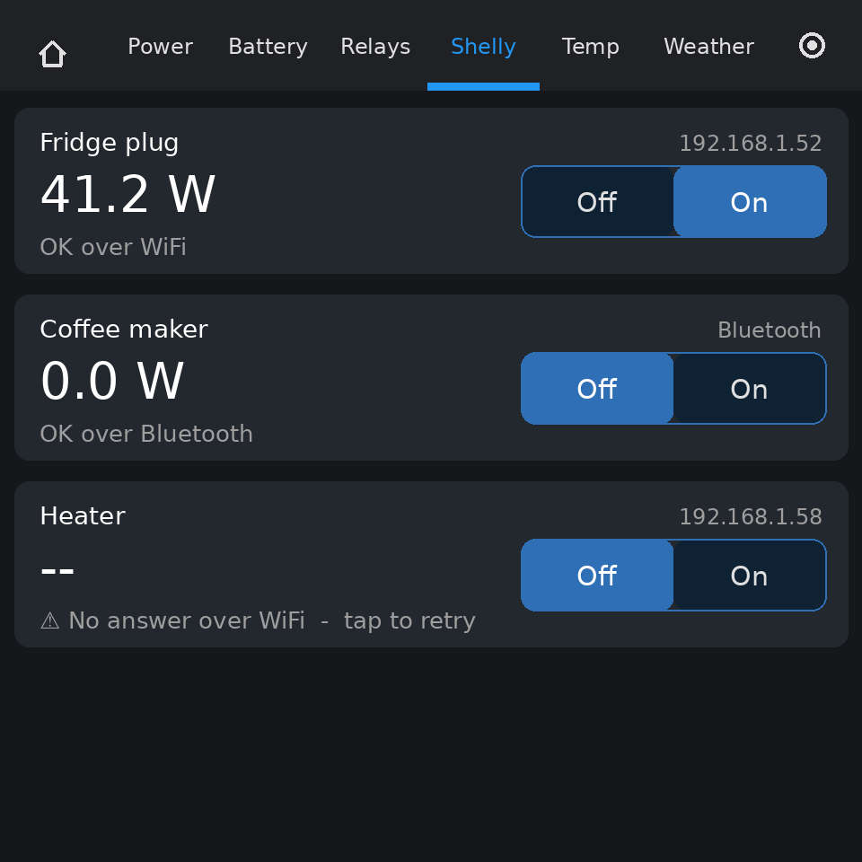 |
| **Relays** – one Off/On control per relay, in the Victron switch-pane style | **Shelly** – plugs and switches over WiFi or Bluetooth, with power and the reason when something fails |
| 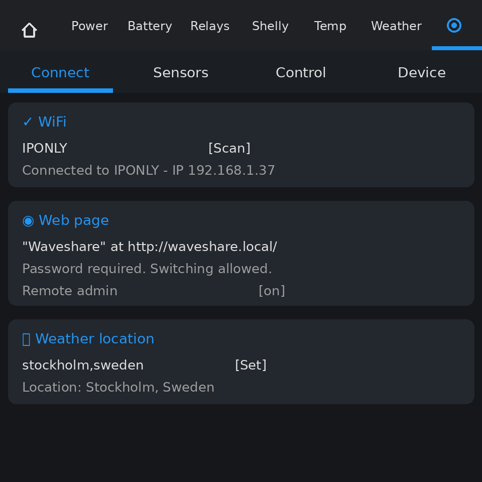 | 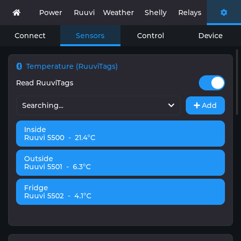 |
| **Settings → Connect** – WiFi, the web page and the weather location | **Settings → Sensors** – RuuviTags, the battery BMS and Victron devices |
| 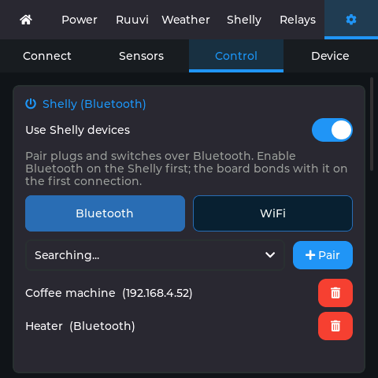 | 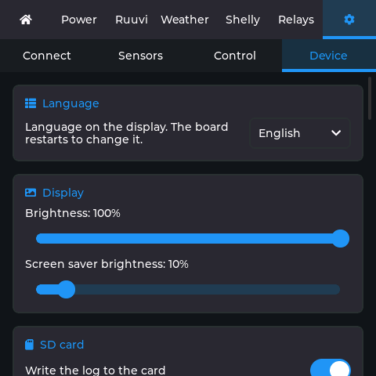 |
| **Settings → Control** – Shelly, schedules, relays and I2C | **Settings → Device** – language, display, power, alarms, SD card |
| 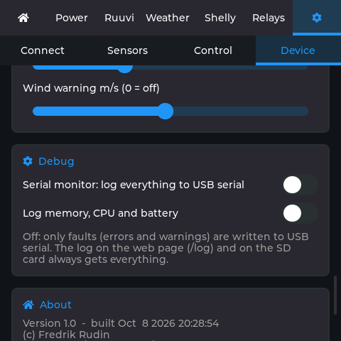 | 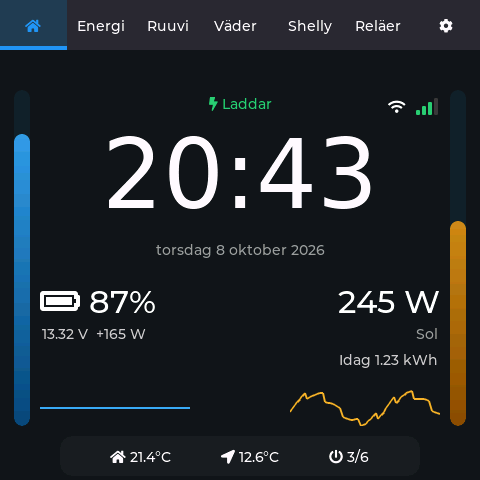 |
| **Settings → Device → Debug** – the serial monitor switch and the performance log | **På svenska** – the same screens in Swedish |

*Screenshots rendered by the firmware's own UI code with LVGL on a PC, with example data
(`tools/screenshots`).*

## Features

| Tab | What it shows |
|---|---|
| **⌂ Start** | Large clock and date between two gradient gauges: battery on the left with Time To Go, solar on the right. Ten-minute graphs under each, then inside and outside temperature and how many relays are on. A warning banner appears across the top when something needs attention |
| **Power** | The battery in the middle, chargers on the left, the AC side on the right, DC loads below. Each connection lights up in its device's colour while energy flows, and the solar, battery and loads tiles carry a ten-minute graph. Tap any tile for the history: solar and consumption per hour over 24 hours, or per day over 7 days |
| **Ruuvi** | Up to 3 named RuuviTags: temperature, humidity, pressure, tag battery and signal, and a chart of the last 7 days per tag: each day's low (blue) and high (orange), in the colours of Victron VRM. The 7-day high and low sit under the reading. The history is kept in flash, so it survives a restart |
| **Weather** | Current conditions, high and low, feels-like, humidity, wind and a 3-day forecast (Open-Meteo) |
| **Shelly** | Up to 4 plugs or switches, each over **WiFi** (local HTTP RPC) or **Bluetooth** (BLE RPC): power, on/off, and the reason when something fails. Hidden until a device is added |
| **Relays** | Up to 8 relays on a PCF8574, each an Off \| On control in the Victron switch-pane style. Hidden until a board answers |
| **⚙ Settings** | Four sub-tabs: Connect, Sensors, Control, Device |

**Schedules**: one per relay and Shelly device, with an on time, an off time and the days it
applies; a window may cross midnight. Switching by hand holds until the next scheduled change.

**Warnings and alarms** appear as a banner on the Start page and at the top of the web page:
battery SOC below your thresholds, battery voltage out of range, inverter alarms, a Victron
device gone quiet, WiFi lost, the relay board not answering, strong wind, and optionally the
SD card. Thresholds are under Settings → Device → Alarms, and a new alarm can wake the screen.

**Running on the onboard battery**: with a LiPo fitted and the setting switched on, losing
external power turns the display into a local instrument: WiFi and Bluetooth off, screen at 10%,
CPU at 80 MHz, the last readings kept on screen and a "Running on battery" banner along the
bottom. At your threshold it closes the log, unmounts the card and sleeps.

**Screen saver**: after 30 s without touch, a 96-pixel clock and an SOC bar on a dimmed screen.

## Settings

Settings has its own row of tabs, so no page is more than a couple of screens long.
Each page is a column of cards.

| Page | Cards |
|---|---|
| **Connect** | **WiFi** (scan, password, status) &middot; **Web page** (run the server, name, password, remote admin) &middot; **Weather location** |
| **Sensors** | **Temperature** (up to 3 RuuviTags) &middot; **Battery (BMS)** &middot; **Victron devices** (add, name, encryption key, live status) &middot; **Sensor scan interval** |
| **Control** | **Shelly** (WiFi or Bluetooth, up to 4) &middot; **Schedules** (per relay and Shelly device) &middot; **Relays** (address, active low, count, names) &middot; **I2C devices** |
| **Device** | **Language** (English, Svenska) &middot; **Power** (CPU slowdown, onboard LiPo, battery mode and its shutdown threshold) &middot; **Display** (brightness, screen saver brightness) &middot; **Alarms** (thresholds, wake the screen, SD warning) &middot; **SD card** (mount, eject, probe, logs, CSV, backup) &middot; **Debug** (serial monitor, performance log) &middot; **About** &middot; **System** (restart, shut down, full reset) |

Temperature, Battery, Relays and Shelly each have an on/off switch: switching one off also stops
its background work and takes its tab off the tab bar. Relays and Shelly also hide themselves
when nothing is connected.


## Language

The display speaks **English** (the default) or **Swedish**, chosen under Settings → Device →
Language. Changing it restarts the board, which takes a few seconds. Both are built into the
firmware, so no SD card is needed. The web page stays in English, apart from the status texts
it shares with the display.

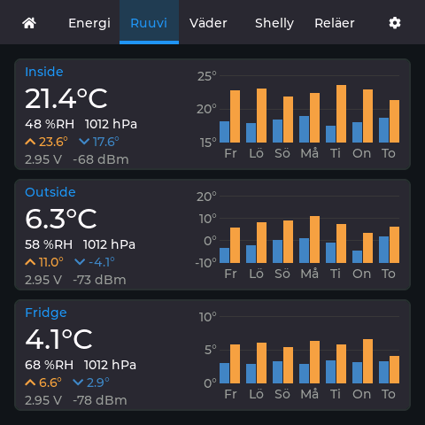

Translations are ordinary gettext `.po` files in `lang/`, so they can be edited with
[Poedit](https://poedit.net/), and new languages can be added the same way. See
[`lang/README.md`](lang/README.md).

## Screen saver

To adjust the look, change these lines at the top of `ui_saver.cpp`:

```cpp
#define SAVER_BAR_BG 0x202020     // empty part of the SOC bar
#define SAVER_LOW_COLOR 0x702020  // bar color at low SOC (dim red)
#define SAVER_LOW_SOC 20          // below this % the bar turns red
```

**Warnings and alarms** appear as a banner on the Home page and at the top of the web page: battery SOC below your thresholds, battery voltage out of range, inverter alarms, a Victron device gone quiet, WiFi lost, the relay board not answering, strong wind and SD card trouble. Thresholds are set under Settings → Alarms, and a new alarm can wake the screen saver.

A small **web page** mirrors the Home tab: clock with battery and solar gauges, temperatures, a weather forecast, the Victron devices (and which are charging), the relays and the Shelly devices. Open **`http://waveshare.local/`** (or the board's IP, shown under Settings → WiFi) from a phone or computer on the same WiFi. It lists the **schedules** with an override button for each, shows the **board battery**, and draws **charts**: bars of solar and consumption per hour over the last 24 hours with the battery percentage as a line, and three ten-minute graphs for solar, battery and consumption. They are plain SVG, so no JavaScript is involved. The same data is available as JSON at `/json`, and the recent log at `/log`. The page is read-only.

The Settings page has its own row of tabs (Connect, Sensors, Control, Device) and is grouped into sections (WiFi, Web page, Weather, Temperature, Battery, Victron, Relays, Display, Scan interval, I2C). **Temperature, Battery, Relays and Shelly each have an on/off switch**: switching one off also stops its background work (Bluetooth decoding, BMS connection, I2C traffic). The Temperature, Battery, Relays and Shelly tabs disappear from the tab bar while they are off. The battery itself is chosen under Settings → Battery.

The web server can be switched off entirely under **Settings → Connect → Web page**, which frees
the memory the page building uses. Otherwise, under **Settings → Web page** you can name the page (default "Waveshare"), switch on **Remote admin** so relays and Shelly devices can be switched from the browser (off by default, and it still requires the password), and set a password; the page then asks for it once (the login lasts 30 days, or until the board restarts or the password changes). Scripts can use `/json?key=<password>`. Leave the password empty for no login. The page uses plain HTTP, so the password keeps casual visitors on the same WiFi out, but is not strong security. The name `waveshare` is set by `MDNS_NAME` in `app.h`.

After 30 seconds without touch, a screen saver shows a dim clock and lowers the backlight. A tap wakes it.

## Version numbers

The version is `FW_VERSION` in `app.h`. It is shown under Settings → Device → About, on the
web page and in the first log line, and every file carries it on its first line as a comment
(`// esp32-S3-ws4-caravan v1.0`). To change it everywhere at once:

```
python3 tools/set_version.py 1.1
```

Run it without a number after adding a file, to tag the new file with the current version.
Every change gets an entry in [CHANGELOG.md](CHANGELOG.md).

## Getting started

1. Install the libraries and set the Arduino IDE options listed below.
2. Open `esp32-S3-ws4-caravan.ino` and upload.
3. On the board, open **⚙ Settings**:
   - **WiFi:** tap Scan, pick your network, enter the password, tap Connect.
   - **Weather location:** type a city (or `City, Country`) and tap Set.
   - **RuuviTags:** pick a tag from the list, tap Add and give it a name. Up to 3 tags; tap one in the list to rename or delete it.
   - **Victron devices:** pick a device, tap Add, then enter a name and its 32-character encryption key.
   - **Relay board:** tap *Scan I2C bus* to find the PCF8574, then choose its address.

The Serial Monitor (115200 baud) shows faults only by default; switch on Settings → Device → Debug → Serial monitor to see startup, free memory, WiFi and weather lookups as well.

## Files

Everything is in one flat folder. `app.h` holds the shared configuration, data types and declarations; each `.cpp` file is one module.

| File | Contents |
|---|---|
| `esp32-S3-ws4-caravan.ino` | `setup()` and `loop()` |
| `app.h` | Configuration, data types, shared state, module functions |
| `state.cpp` | Shared state, loading settings, small helpers |
| `sdlog.cpp` | Logging to Serial, to a memory buffer (web `/log`) and to the TF card |
| `datalog.cpp` | Measurements as CSV, settings backup and restore |
| `board.cpp` | Display, touch, IO expander, LVGL driver, backlight |
| `net.cpp` | Network task: WiFi, NTP, weather, all flash writes |
| `web.cpp` | Web page and JSON with battery, Victron and relay status |
| `ble.cpp` | Bluetooth scanning |
| `bms.cpp` | Battery BMS connection: ECO-WORTHY and JBD protocols, plus diagnostics |
| `shelly.cpp` | Shelly devices over BLE RPC (pairing, status, switching) |
| `ruuvi.cpp` | RuuviTag decoding |
| `victron.cpp` | Victron decryption and decoding |
| `schedule.cpp` | Timed switching for relays and Shelly devices |
| `ui_schedule.cpp` | Schedule editing in Settings |
| `sw6106.cpp` | Power bank controller keep-alive, where fitted |
| `relays.cpp` | PCF8574 relays and I2C scan |
| `ui_common.cpp` | Tabs, keyboard, widget helpers, timers |
| `ui_home.cpp` | Home tab (start page) |
| `ui_power.cpp` | Power tab |
| `history.cpp` | Energy history: hourly and daily totals |
| `ui_history.cpp` | History screen (bar chart, opened from the Power tab) |
| `ui_battery.cpp` | Battery tab (experimental) |
| `ui_relays.cpp` | Relays tab + relay and I2C settings |
| `ui_shelly.cpp` | Shelly tab + Shelly pairing settings |
| `ui_temp.cpp` | Ruuvi tab (RuuviTag cards with a 7-day chart each) |
| `ruuvi_hist.cpp` | Daily low and high per RuuviTag for the last 7 days, kept in flash |
| `ui_weather.cpp` | Weather tab and clock |
| `ui_settings.cpp` | Settings tab (WiFi, location, RuuviTags, display, scan interval) |
| `ui_victron_settings.cpp` | Victron device settings |
| `ui_saver.cpp` | Screen saver |
| `font_clock_96.c` | 96 px clock font for the screen saver (digits, `:` and `-`) |
| `lang.cpp` | Language: looks texts up in the built-in translations, swaps in the Latin-1 fonts |
| `lang_tables.h` | The built-in translations, generated from `lang/*.po` by `tools/i18n.py` |
| `font_latin1.c` | The Latin-1 letters (å ä ö é ü ...) missing from LVGL's built-in fonts, used when translated |
| `lang/` | `caravan.pot` (the texts to translate) and one `.po` file per language |
| `tools/` | `i18n.py` (template and built-in tables), `gen_font_latin1.py` (the fonts), `set_version.py` (the version, everywhere), `screenshots/` (the README images, rendered on a PC) |
| `screen-*.png` | Screenshots for this README, rendered by `tools/screenshots` |
| `memory.md` | Notes and plan for lowering memory use and latency |
| `CHANGELOG.md` | What changed in each version |
| `lv_conf.example.h` | LVGL settings that suit this board and PSRAM-less boards alike |

## Libraries

- **lvgl 8.x** (with the `lv_conf.h` from Waveshare's examples)
- **GFX Library for Arduino**, **SensorLib** and **WS_CH32_IO**: the versions bundled with Waveshare's ESP32-S3-Touch-LCD-4 examples
- **ArduinoJson** v7
- **NimBLE-Arduino** by h2zero, v2.x

## ESP32-S3-Touch-LCD-4 Library file installation instructions

Waveshare's own instructions for this board and their example sketches. **This firmware
needs the libraries listed under [Libraries](#libraries) instead**: it uses GFX Library for
Arduino, SensorLib and WS_CH32_IO, because the V4 board has the CH32V003 chip rather than
the TCA9554 expander. The table is here because `lvgl` and `lv_conf.h` are shared, and the
offline copies below are the versions this board is tested with.

| Library Name | Description | Version | Library Installation Requirements |
|---|---|---|---|
| ESP32_Display_Panel | ST7701, GT911 driver library | v0.1.8 | "Install Online" or "Install Offline" |
| ESP32_IO_Expander | TCA9554 IO expansion chip driver library | v0.0.4 | "Install Offline" (return value of IOExpander_Library changed) |
| lvgl | LVGL graphical library | v8.4.0 | "Install Online" requires copying the demos folder to src after installation. "Install Offline" is recommended |
| lv_conf.h | LVGL configuration file | —— | "Install Offline" |

The libraries to install offline are in Waveshare's repository:
<https://github.com/waveshareteam/ESP32-S3-Touch-LCD-4/tree/main/examples/arduino/libraries>

## Arduino IDE settings

- Board: ESP32S3 Dev Module
- **PSRAM: OPI PSRAM** (the display framebuffer and LVGL buffers live there)
- **Erase All Flash Before Sketch Upload: Disabled**, otherwise every upload wipes the saved settings

⚠️ **`lv_conf.h` is shared by every sketch on your machine.** A copy written for a board
without PSRAM (a small pool in internal RAM) will make this firmware run out of memory while
building the UI and crash with `LoadProhibited`. `lv_conf.example.h` in this repository
chooses the right pool automatically from `BOARD_HAS_PSRAM`, so it suits both this board and
boards without PSRAM; copy it to `<Arduino>/libraries/lv_conf.h`. The boot log prints the pool
size and warns if it ends up in the wrong place.

Optional, in `lv_conf.h`:

- Enable `LV_FONT_MONTSERRAT_32` and `LV_FONT_MONTSERRAT_48` for a large clock and temperatures
- To free internal RAM, move LVGL's memory pool to PSRAM:
  ```c
  #define LV_MEM_POOL_INCLUDE <esp32-hal-psram.h>
  #define LV_MEM_POOL_ALLOC ps_malloc
  ```

## Logging

Everything the firmware logs goes to a 24 kB buffer in PSRAM that you can read in a browser
at `/log` without attaching a computer, and to the TF card when that is switched on.

**USB serial (Arduino's Serial Monitor):** off by default, and then only faults are written
there: errors and warnings, such as an SD card that can't be found, a lost WiFi connection, a
touch controller that didn't answer, low memory or a battery shutdown. Switch on
**Settings → Device → Debug → Serial monitor** to see everything as well: the boot figures,
memory, connections and sensor details. The switch is saved, and it is read first thing at
start-up, so the boot lines follow it too. ESP-IDF's own messages follow it as well: errors
only when it's off, warnings too when it's on. The same section has **Log memory, CPU and
battery**, a status line every few seconds for chasing memory or stack problems.
Switch on **Settings → SD card** to also append everything to `/caravan.log` on the TF card
(SPI: GPIO2 clock, GPIO1 MOSI, GPIO4 MISO). The file is flushed every 5 seconds. The same section has Mount, Eject, New log and Delete old logs, plus card type and free space. Log files can be listed and downloaded in the browser at `/files`.

**Measurements as CSV:** switch on "Log measurements" to append a line to `/data.csv` every 1, 5, 15 or 60 minutes: time, SOC, battery voltage/current/power, solar power and yield, the three RuuviTag temperatures, outside temperature, relays on and Shelly power. Download it from `/files` and open it in a spreadsheet.

**Running on the onboard battery:** with a LiPo in the board's connector and "Keep running on the
battery" switched on under Settings → Device → Power, losing external power turns the display into
a local instrument: WiFi and Bluetooth off, screen at 10%, CPU at 80 MHz, the last readings kept on
screen and a "Running on battery" banner along the bottom with the charge left. At the threshold
you set (20% by default) it closes the log, unmounts the card and sleeps. Plugging power back in
restarts the board so both radios come up cleanly. A 1200 mAh cell lasts roughly 10–15 hours.

**Restart, shut down, full reset:** the System section at the end of Settings. Each asks for confirmation. Shutting down puts the board into deep sleep with the backlight off; the reset button wakes it. A full reset erases every setting, so back up to the card first.

**Settings backup:** "Back up settings" writes everything to `/settings.json` on the card, including WiFi and Victron encryption keys, so keep the card safe. "Restore" reads it back and restarts the board, which is the quick way back after an accidental flash erase.

## Hardware notes

- **Backlight** PWM comes from the CH32V003 and is inverted on this board (0 = full brightness, 255 = off). This is handled in `set_backlight()`.
- **TF card**: on the V4 board the slot works over **SPI** (SCK GPIO2, MOSI GPIO1, MISO GPIO4), with chip select handled on the board. Waveshare's own `10_LVGL_SD` example uses SD_MMC and does not work on this revision (error `0x107`, `send_op_cond` timeout). Settings → SD card → **Probe card** tries both modes and every expander bit if a card is ever not found.
- **External I2C** shares GPIO15/7 with touch and the CH32V003. The PCF8574 only supports 100 kHz, so the bus slows down briefly while talking to it.
- ⚠️ Many PCF8574 relay boards pull I2C up to 5 V. The ESP32 is **not** 5 V tolerant: power the PCF8574 from 3.3 V, or make sure its pull-ups go to 3.3 V.
- **Victron**: enable *Instant readout via Bluetooth* in VictronConnect and copy the encryption key from *Product info*.
- **Battery tab (experimental)**: pick the battery in the list and tap Connect. Close the ECO-WORTHY app first, as the battery accepts only one Bluetooth connection. Batteries with a JBD BMS are decoded; for other BMS types the tab and the Serial Monitor show the GATT services and raw data, which is what's needed to add support.
- **Weather** uses plain HTTP: HTTPS needs more internal RAM than is free with WiFi, Bluetooth and the display running.

## Troubleshooting

| Problem | Likely cause |
|---|---|
| Settings are gone after an upload | *Erase All Flash Before Sketch Upload* is enabled |
| City lookup or weather fails | Check the `HTTP` and `Internal heap` lines in the Serial Monitor (failed requests are always shown). Low free RAM breaks network requests |
| Victron device shows "Wrong key" | Key mistyped, or it changed in VictronConnect |
| Victron device shows "No signal" | Out of range, or Instant readout switched off |
| Relays show "No answer from PCF8574" | Wrong address (run the I2C scan), wiring, or power |
| Relays switch the wrong way | Toggle *Active low* in Settings |
| Image shifted down (tab bar too low) | The RGB panel lost sync, usually at startup. Press reset. The pixel clock is set to 12 MHz in `board.cpp` to reduce it; bounce buffers would fix it properly but need a newer GFX Library for Arduino |
